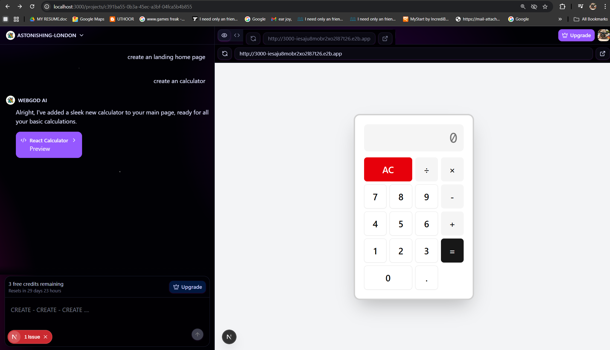

# WebGod Website Builder

WebGod is a modern, full-stack website builder application built with Next.js, TypeScript, Prisma, and Inngest. It provides a flexible platform for creating, managing, and deploying web projects with a rich set of UI components and integrations.

## Features
- Next.js app directory structure
- TypeScript for type safety
- Modular UI components (Accordion, Dialog, Table, etc.)
- Prisma ORM for database management
- API routes for backend logic
- Project management module
- Event-driven backend with Inngest
- Hooks and utilities for enhanced functionality

## Output Example




## Getting Started
1. Install dependencies:
	```cmd
	npm install
	```
2. Set up the database:
	```cmd
	npx prisma migrate dev
	```
3. Start the frontend (Next.js):
	```cmd
	npm run dev
	```
4. Start the backend (Inngest):
	```cmd
	npx inngest-cli@latest dev
	```

## Scripts
- `npm run dev` - Start development server (frontend)
- `npx inngest-cli@latest dev` - Start backend event server
- `npm run build` - Build for production
- `npm run lint` - Run ESLint

## License
MIT
